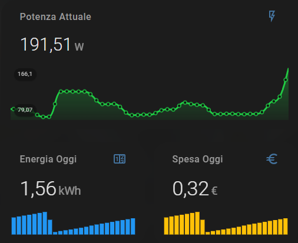

# Pinza Amperometrica — Energy Monitor IoT

Monitor energetico open source basato su ESP8266 e sensore CT. Visualizza consumo istantaneo, energia giornaliera e costo in tempo reale tramite Home Assistant.

**Stack:** ESP8266 · Sensore CT · ESPHome · Home Assistant

---

## Componenti necessari

| Componente | Quantità | Note |
| :--- | :---: | :--- |
| ESP8266 (es. Wemos D1 Mini) | 1 | Qualsiasi variante con pin A0 |
| Condensatore elettrolitico 10 µF | 1 | Polarizzato, occhio al verso |
| Resistenza 10 kΩ | 2 | Partitore di tensione per il bias |
| Pinza amperometrica YHDC SCT-013 | 1 | Vedi sezione scelta del modello |
| Cavi jumper | q.b. | — |

### Scelta del modello SCT-013

Per ambienti domestici con contratto da 3 kW le correnti raramente superano i 16–20 A. Un sensore da 100 A avrebbe ridotto la sensibilità ai carichi ridotti.

È stato scelto il modello **SCT-013-030** (range 0–30 A, uscita 0–1 V), che offre:
- Alta accuratezza a bassi carichi (tipici di un'abitazione)
- Margine di sicurezza fino a circa **6,9 kW**
- Uscita in tensione (non richiede resistenza di burden esterna)

---

## Schema di collegamento

```
    .-----------.
    |           |
    |      3.3V |-------[ R 10kΩ ]-------+
    |           |                        |
    |           |                      __|__
    |           |                  C1  /////  (Lato +)
    |           |                  10µF____   (Condensatore)
    |           |                        |    (Lato -)
    |       GND |-----------+------------+
    |           |           |
    |           |           '----[ R 10kΩ ]-----.
    |           |                               |
    |           |                               | (Cavo "-" Pinza)
    |           |                        .-------------.
    |           |                        |    PINZA    |
    |        A0 |<-----------------------|   SCT-013   |
    |           |       (Cavo "+" Pinza) '-------------'
    '-----------'
```

Le due resistenze formano un **partitore di tensione** che porta il punto di riferimento del segnale AC a metà alimentazione (1,65 V), necessario perché l'ADC dell'ESP8266 non accetta tensioni negative.

---

## Codice ESPHome

### 1 — Lettura ADC e calibrazione corrente

```yaml
# Configurazione base di ESPHome (wifi, api, ota…) omessa per brevità

time:
  - platform: homeassistant
    id: home_time

sensor:
  # Lettura grezza dal pin A0
  - platform: adc
    pin: A0
    id: adc_sensor

  # Sensore CT — calcola il valore RMS della corrente
  - platform: ct_clamp
    sensor: adc_sensor
    name: "Corrente Attuale"
    id: measured_current
    update_interval: 5s   # 5 s: buon compromesso tra reattività e dimensioni del DB
    filters:
      # Calibrazione: confrontare con un multimetro e regolare il secondo punto
      - calibrate_linear:
          - 0.0 -> 0.0
          - 0.1 -> 3.0   # 0,1 V letti → 3 A reali (adattare alla propria installazione)
```

> **Nota sulla calibrazione:** misurare un carico noto (es. un bollitore da 2 kW) con un multimetro di riferimento e aggiustare il secondo punto della retta finché i valori coincidono.

---

### 2 — Potenza istantanea (W)

```yaml
  - platform: template
    name: "Consumo Istantaneo"
    id: power_watts
    unit_of_measurement: W
    icon: "mdi:flash"
    accuracy_decimals: 1
    update_interval: 5s
    lambda: |-
      // Potenza apparente: P = V x I  (tensione di rete fissa a 230 V)
      return id(measured_current).state * 230.0;
    filters:
      # Soglia minima: evita rumori sotto i 5 W
      - lambda: if (x < 5.0) return 0.0; else return x;
```

> **Nota:** questo calcola la **potenza apparente** (VA), non quella attiva (W). Per carichi resistivi (stufe, bollitori) l'errore è trascurabile. Per carichi reattivi (motori, inverter) il valore sarà sovrastimato.

---

### 3 — Energia giornaliera (kWh)

```yaml
  - platform: total_daily_energy
    name: "Energia Oggi"
    id: energy_today
    power_id: power_watts
    unit_of_measurement: kWh
    icon: mdi:counter
    filters:
      - multiply: 0.001   # Converte Wh in kWh
```

Il contatore si azzera automaticamente a mezzanotte (richiede la piattaforma `time` configurata).

---

### 4 — Costo giornaliero (€)

```yaml
  - platform: template
    name: "Spesa Oggi"
    unit_of_measurement: "€"
    accuracy_decimals: 2
    icon: "mdi:currency-eur"
    update_interval: 10s
    lambda: |-
      // Sostituire 0.25 con il proprio costo al kWh (€/kWh)
      return id(energy_today).state * 0.25;
```

---

## Installazione e sicurezza

L'installazione richiede l'apertura del quadro elettrico generale.

**Pericolo di elettrocuzione.** Spegnere sempre l'interruttore generale prima di aprire il quadro e verificare l'assenza di tensione con un tester.

**Isolamento.** Assicurarsi che ESP8266 e tutti i cavi a bassa tensione siano ben isolati e non possano entrare in contatto con barre o morsetti a 230 V.

**Verso della pinza.** Per utenze passive il verso è indifferente. Se si monitora un impianto fotovoltaico (flusso bidirezionale) verificare il verso per distinguere importazione ed esportazione.

**Uso sperimentale.** Questo progetto è a uso hobbistico e non sostituisce un contatore omologato.

---

## Galleria

| Quadro elettrico (raw) | Installazione completa | Dashboard Home Assistant |
| :---: | :---: | :---: |
|  |  |  |

---

## Licenza

Progetto open source — contributi e fork benvenuti.
