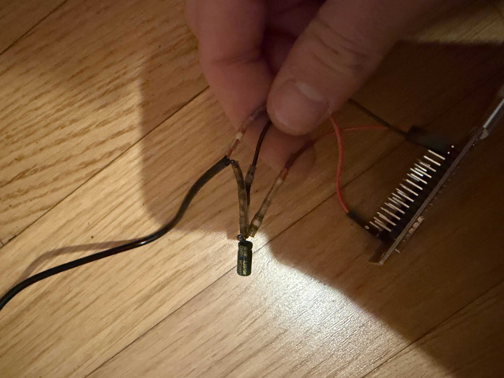
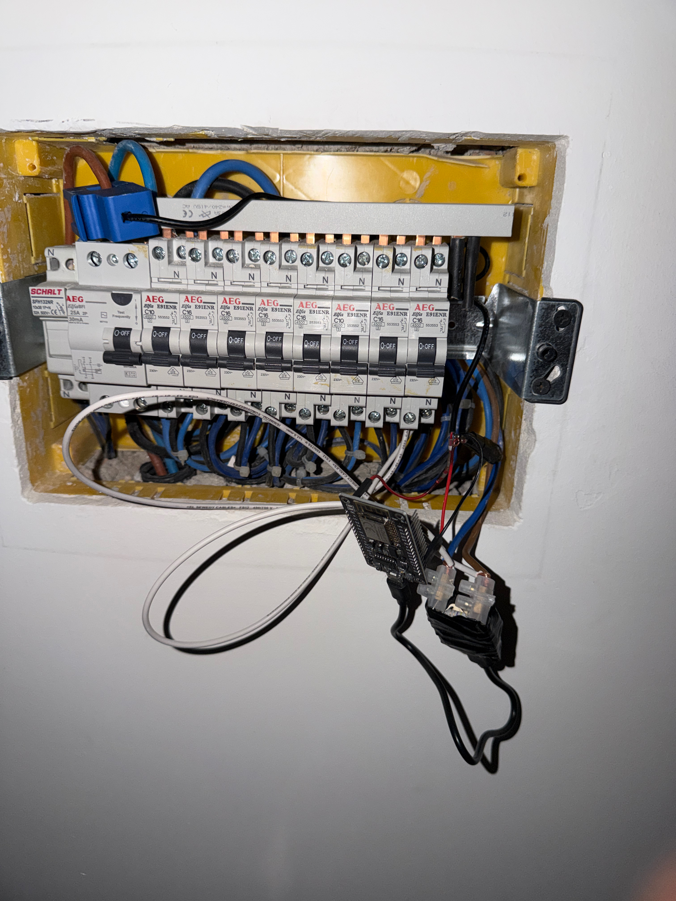
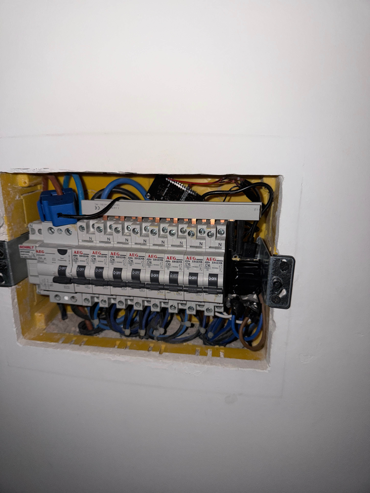

# pinza-amperometrica
Energy Monitor IoT open source. Stack: ESP8266, sensore CT, ESPHome e Home Assistant. Repository con codice sensore e interfaccia grafica per la visualizzazione del consumo istantaneo, totale giornaliero e costo in tempo reale.

## Necessario
| Componenti | Dettaglio Saldatura |
| :--- | :--- |
| <ul><li>1 ESP8266</li><li>1 condensatore 10μF (Elettrolitico)</li><li>2 resistenze 10kΩ</li><li>Pinza amperometrica YHDC SCT-013</li><li>Cavi jumper</li></ul> |  |

### Scelta della pinza ampeometrica
Il dimensionamento del sensore di corrente è stato effettuato cercando il miglior compromesso tra range di misurazione e risoluzione. Per ambienti domestici standard con contratto di fornitura da 3 kW, le correnti raramente superano i 16-20 Ampere. L'utilizzo di un sensore con fondo scala a 100A avrebbe ridotto la sensibilità ai bassi carichi. Per la mia abitazione sitmando i consumi medi ho scelto il modello SCT-013-030 (range 0-30A, output 0-1V), che garantisce un'elevata accuratezza nella lettura dei consumi ridotti tipici dell'abitazione, mantenendo comunque un margine di sicurezza per carichi fino a circa 6,9 kW.

## Schema di Collegamento

```text
    .-----------.
    |           |
    |      3.3V |-------[ R 10kΩ ]-------+
    |           |                        |
    |           |                      __|__
    |           |                  C1  /////  (Lato +)
    |           |                  10uF____   (Condensatore)
    |           |                        |    (Lato -)
    |       GND |-----------+------------+
    |           |           |
    |           |           '----[ R 10kΩ ]-----.
    |           |                               |
    |           |                               | (Cavo "-" Pinza)
    |           |                        .-------------.
    |           |                        |    PINZA    |
    |        A0 |<-----------------------|   SCT-013   |
    |           |       (Cavo "+" Pinza) '-------------'
    '-----------'
```

## Codice
### Inizializzazione & Lettura Segnale (Ampere)

```yaml
#configurazione base di esphome
#...

time:
  - platform: homeassistant
    id: home_time

sensor:
  - platform: ct_clamp
    sensor: adc_sensor
    name: "Corrente Misurata"
    id: measured_current
    update_interval: 5s  # Consigliato: 5s. 
                         # Evita di riempire il DB di hassio e riduce il carico sull'ESP. 
    filters:
      # Calibrazione fine: aggiustare questi valori confrontandoli con un multimetro
      - calibrate_linear:
          - 0.0 -> 0.0
          - 0.1 -> 3.0  # Esempio: a 0.1V letti corrispondono 3A reali
    
  # Inizializzazione (Pin A0)
  - platform: adc
    pin: A0
    id: adc_sensor
```

### Calcolo Potenza Istantanea (Watt)

```yaml
- platform: template #Si crea il template per visualizzare una nuova entita correlata al sensore
    name: "Consumo Istantaneo"
    id: power_watts
    unit_of_measurement: W
    icon: "mdi:flash"
    accuracy_decimals: 1
    update_interval: 5s #Stesso discorso per la misura degli Ampere (non necessare troppe misurazioni)
    lambda: |-
      // P = V * I (Assumiamo tensione fissa a 230V)
      return id(measured_current).state * 230.0;
    filters:
      # Azzera se il consumo è inferiore a 5W
      - lambda: if (x < 5.0) return 0.0; else return x;
```

### Conversione in kWh (si resetta ogni giorno)

```yaml
  - platform: total_daily_energy
    name: "Energia Consumata Oggi"
    power_id: power_watts
    filters:
      # Converte da Wh a kWh
      - multiply: 0.001
    unit_of_measurement: kWh
    icon: mdi:counter
```

# Installazione e sicurezza
L'installazione prevede l'inserimento del sensore nel quadro elettrico generale.
- **Pericolo Elettrico: Spegnere sempre l'interruttore generale prima di aprire il quadro.**
- Posizionamento Pinza: Poiché questo codice calcola la potenza apparente (I * 230V) per utenze passive, il verso della freccia sulla pinza è indifferente. *Se si monitora un impianto fotovoltaico (bidirezionale), sarà necessario verificare il verso per distinguere importazione ed esportazione.*
- **Isolamento: Assicurarsi che tutte le parti del circuito a bassa tensione (ESP8266 e cavi) siano ben isolate e non entrino in contatto con le barre di rame o i morsetti a 230V del quadro.**

# Galleria
| Quadro Elettrico (Raw) | Installazione Completa | Visualizzazione Hassio |
| :---: | :---: | :---: |
|  |  |  |
